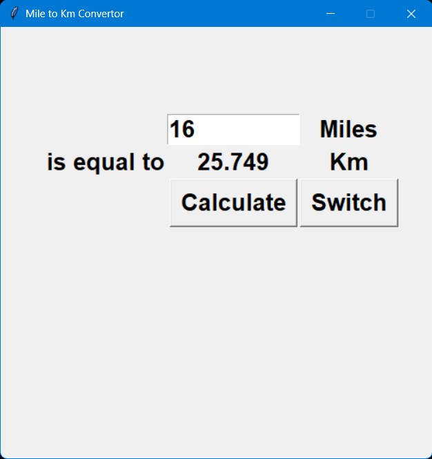
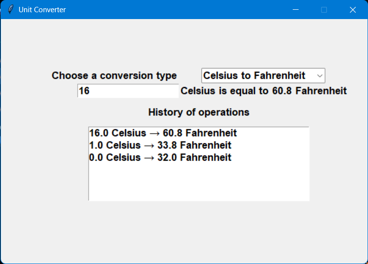
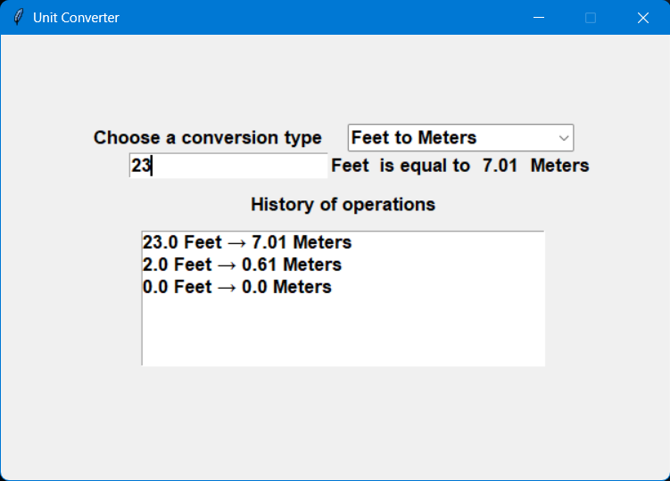

# 🧮 Unit Converter Evolution (Tkinter)

This repository demonstrates the evolution of a Python Tkinter unit converter from a simple procedural script to a fully object-oriented application.

The project was created to practice Python GUI development, code refactoring, and Object-Oriented Programming (OOP).

# 📌 Project Overview

This project contains four versions of the same application, each improving the previous one.

## 01_basic_converter.py
- Simple Miles ↔ Kilometers converter
- Procedural programming approach
- Basic Tkinter interface

## 02_multi_converter.py
- Multiple unit conversions
- Combobox selection
- Real-time updates
- Conversion history (Listbox)

## 03_oop_refactor.py
- First step into OOP
- Conversion logic moved into a class
- Reduced code duplication
- Cleaner structure

## 04_final_oop_version.py
- Fully object-oriented version
- Class inherits from Tk
- Clean architecture and encapsulation
- Multiple unit types supported:
  - Distance
  - Temperature
  - Weight
  - Length
- Improved validation and UI updates
- Conversion history (last 10 operations)

# 🚀 Features

- Real-time unit conversion
- Multiple conversion categories
- Interactive GUI using Tkinter
- Conversion history tracking
- Clean OOP architecture (final version)

# 🛠 Technologies

- Python 3
- Tkinter
- Object-Oriented Programming (OOP)

# 📸 Screenshots

<p align="center">
  <br>
  <b>Basic version</b>
</p>

<p align="center">
  <br>
  <b>Multi converter</b>
</p>

<p align="center">
  <br>
  <b>Final OOP version</b>
</p>

⚠️ Note: Final versions have similar UI, but differ in architecture:
- OOP structure
- better validation
- improved history handling

# 📚 What I learned

- How to build GUI applications with Tkinter
- How to refactor procedural code into OOP
- How to manage application state
- Handling user input and events
- Structuring a multi-version project
- Basic Git & GitHub workflow

# ▶️ How to run

Run any version:
```
python 01_basic_converter.py
```

or

```
python 04_final_oop_version.py
```

# 📁 Project structure

```
unit-converter-evolution/
│
├── 01_basic_converter.py        # Basic procedural converter (Miles ↔ Km)
├── 02_multi_converter.py        # Multi-unit converter with combobox + history
├── 03_oop_refactor.py           # First OOP refactor (class-based structure)
├── 04_final_oop_version.py      # Final OOP version (Tk inheritance, clean architecture)
│
├── README.md                    # Project documentation
├── LICENSE                      # License file (e.g. MIT License)
├── .gitignore                   # Files ignored by Git (cache, venv, etc.)
│
└── images/                      # Screenshots for README
    ├── basic.png
    ├── multi.png
    └── oop_final.png
```

# ⭐ Possible Future Improvements

- Add dark / light theme support
- Save conversion history to a file (persistent storage)
- Add more unit categories (speed, time, energy, etc.)
- Convert the project into a web application using Flask or Django
